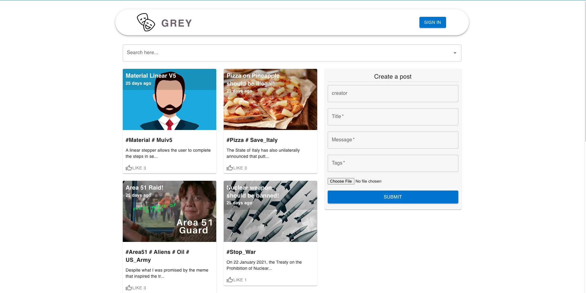

# Grey

An anonymous forum app where people can post anonymously.

## Image

## What is Grey?

- It's a anonymous forum app, where user can create posts. The main idea is to create a CRUD application.
- User will be able to see or create posts.
- Can upload pictures.
- Can like posts.
- Can edit or delete own posts.
- User can search posts.

## Tech Stack

- ReactJS, ReduxJS, MaterialUI
- MongoDB, Express

## Installation

- Fork and clone this repository.
- `cd client` into the cloned repo's client directory and run `npm install`.
- Run `npm start` and the React app should start.

- Open another terminal in the root directory and go to the server directory: `cd server`.
- Run `npm install` to install server dependancies.
- Following the .env.example file, add an .env file in the server directory with the respective variables.
- If you have nodemon installed run `npx nodemon`to start the server.
